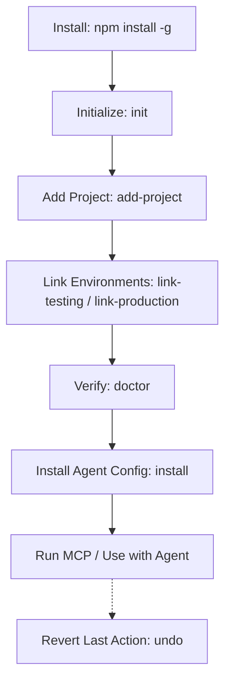

# WorkspaceSync

> **Security-hardened local Model Context Protocol (MCP) server** that gives AI coding assistants a reliable, persistent map of your multi-project workspace and testing/production servers—without ever exposing your SSH keys or credentials.



---

## 1. What WorkspaceSync Is & How It Works

WorkspaceSync maps your local project paths and links them to remote servers via SSH aliases. It runs as an MCP stdio server that your IDE's AI assistant (such as Cline, Claude, or VS Code) connects to. This allows the agent to check deployment states, query service logs, and perform comparisons without direct access to your credentials.

### Conceptual Map
```
Workspace (Root Directory)
  └── Project Registry (.workspace-sync/)
        ├── LOCAL      → Read + Write Access (Local paths, Git metadata)
        ├── TESTING    → Read-Only Access (Remote SSH Alias → Target Path)
        └── PRODUCTION → Strict Read-Only Access (Remote SSH Alias → Target Path)
```

---

## 2. Installation & Requirements

Ensure all prerequisites and commands are followed sequentially.

### Prerequisites

| Dependency | Minimum Version | Verification Command |
|---|---|---|
| **Node.js** | `18+` | `node --version` |
| **npm** | `9+` | `npm --version` |
| **Git** | Any | `git --version` |
| **SSH** | Any system client | `ssh -V` |

> [!NOTE]
> **Windows Users**: An active SSH agent (like OpenSSH for Windows or Pageant) is required. The system `ssh` binary must be available on your PATH.

### Global Installation

To install WorkspaceSync globally on your system:

```bash
npm install -g workspace-sync
```

Verify that the CLI has been installed successfully:

```bash
workspace-sync --version
# Output: workspace-sync 0.1.0
```

---

## 3. Initial Setup & Configuration

After installation, set up the configuration registry within your workspace root directory.

### Initialize Workspace

Navigate to your workspace root directory and run the initialization command:

```bash
cd /path/to/your-workspace
workspace-sync init --name "MyWorkspace"
```

This creates the `.workspace-sync/` directory containing configuration mappings and the `AGENT_MEMORY.md` file:
```
.workspace-sync/
├── workspace.json       # Workspace metadata
├── projects.json        # Registered project configurations (initially empty)
├── environments.json    # Target VPS server references (initially empty)
├── policies.json        # Project read/write policies (initially empty)
└── AGENT_MEMORY.md      # Auto-generated agent context instructions
```

---

## 4. Basic Usage

Use these fundamental commands to register projects and manage your workspace configuration.

### Register a Project
Register a local project directory in WorkspaceSync:
```bash
workspace-sync add-project api ./api-service --git https://github.com/org/api.git
```

### Link VPS Environments
Link your Testing and Production environments to your project. Use SSH aliases configured in your local `~/.ssh/config` (never pass credentials directly).
```bash
workspace-sync link-testing api my-testing-vps /var/www/api
workspace-sync link-production api my-production-vps /var/www/api
```

### Show Workspace Status
Display registered projects, local Git statuses, and environment mappings:
```bash
workspace-sync status
```

---

## 5. Project Setup & Workspace Management

Follow this end-to-end workflow to register, update, and manage your projects.

```
[Register Project] ──> [Link Server Aliases] ──> [Validate Connections] ──> [Deploy Skills]
```

### Step 1: Register Projects
Add all projects belonging to the workspace:
```bash
workspace-sync add-project admin ./admin-panel
workspace-sync add-project api ./api-service
```

### Step 2: Link Remote Environments
Map SSH aliases to target paths:
```bash
workspace-sync link-testing admin test-vps /var/www/admin
workspace-sync link-testing api test-vps /var/www/api
```

### Step 3: Run Self-Diagnostics
Verify all local paths exist and remote SSH connections are successful:
```bash
workspace-sync doctor
```

### Step 4: Install MCP Config & Skills
Deploy VS Code settings and modular AI agent skills:
```bash
workspace-sync install
```

### Step 5: Perform Rollbacks (Undo)
If you run a configuration command by mistake (e.g. accidentally unregistering a project), you can perform a one-step rollback:
```bash
workspace-sync undo
```

---

## 6. Common Workflows & Examples

Here is how you and your AI assistant interact with WorkspaceSync:

### Developer: Removing a Project Safely
To remove a project registration without touching local source code or remote files:
```bash
workspace-sync remove-project api
```
If you need to bypass confirmation prompts (e.g. in scripts):
```bash
workspace-sync remove-project api --yes
```

### AI Agent: Inspecting and Debugging
Once the server is configured, your AI assistant can execute remote tasks:
1. **Compare Commits**: Compare what commits are deployed on Testing vs Production:
   - Tool used: `compare_environments`
2. **Read Logs**: Retrieve the latest systemd logs from the Testing VPS to debug a crash:
   - Tool used: `remote_logs`
3. **Verify Runtime**: Inspect processes running on the Production VPS:
   - Tool used: `remote_processes`

---

## 7. Advanced & Developer Details

Detailed developer docs, internal schemas, security details, and MCP tool protocols are kept separate from the user guides.

- **Developer Guide**: [DEVELOPER.md](docs/DEVELOPER.md)
  - Full ASCII System Topology & Diagrams
  - JSON Schema References (`projects.json`, `policies.json`, etc.)
  - Model Context Protocol (MCP) Tools List & Schema Definition
  - Secrets Redaction RegEx and Logs Architecture
  - Compilation, watching, and unit test suites commands

---

## 8. Contributing

Contributions are welcome! If you would like to help improve WorkspaceSync, please check out the step-by-step guide in [CONTRIBUTING.md](CONTRIBUTING.md) to learn how to fork, clone, set up, test, and open a Pull Request.

