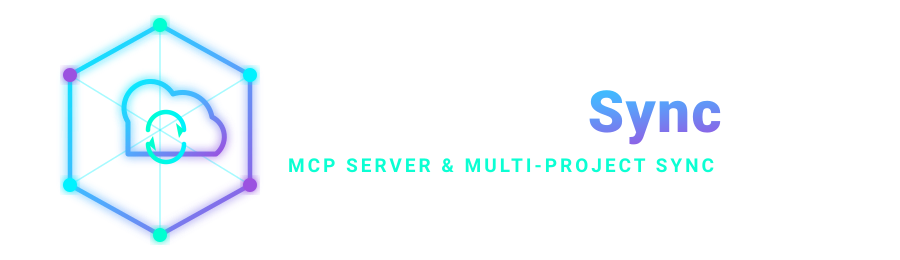

<p align="center">
  
</p>

# WorkspaceSync


> Security-hardened local Model Context Protocol (MCP) server & CLI tool that provides AI coding assistants with a persistent map of your workspace projects and remote servers over SSH aliases.

## What does WorkspaceSync do?

When you ask an AI coding assistant for help, it normally only sees the one folder you have open. It has no idea that the same project also runs on a test server and a production server, where those servers are, or which version of your code is live on each. So you end up re-explaining your setup every session — and the assistant still can't go check anything itself.

WorkspaceSync fixes that. You register your projects once and link each one to its Testing and Production servers using SSH connections you've **already** set up. From then on your AI assistant automatically knows which projects exist and where they live on your machine, which servers each one is deployed to, and what is actually running on those servers right now.

The practical payoff: you can ask *"why is the login page broken in production?"* and the assistant can actually go and look — read the live logs, check which commit is deployed, compare it against your local code — instead of guessing.

**Testing and Production are strictly read-only.** WorkspaceSync can inspect your servers but never modify them, so an AI assistant can investigate a live incident with no risk of changing or breaking it.

If you find this project useful, consider giving it a ⭐ on GitHub!

---

## ⚡ Quick Setup (Recommended)

Setup is two explicit steps: install the **project**, then install the **AI agent integration** for whichever agent you use. Keeping these separate means `setup` never guesses or writes agent-specific config on your behalf.

### Step 1: Install the project

```bash
npx workspace-sync setup
```

This one command:
- Detects your current workspace and any local project folders (via `package.json`, `.git`, `go.mod`, and similar markers).
- Initializes WorkspaceSync configuration — or safely preserves it if one already exists.
- Auto-registers discovered projects and generates `AGENT_MEMORY.md`.
- Verifies the result — all with minimal user interaction.

`setup` **only installs the project.** It does not write any AI agent or MCP configuration — that's Step 2.

### Step 2: Install your AI agent integration

Make your AI agent always aware of your workspace map. Run the install command for whichever AI coding agent you use once per project — see the [🔌 Agent Installation](#-agent-installation) table below. For example:

```bash
workspace-sync install claude
```

This writes the MCP server registration for that specific agent and deploys the WorkspaceSync skills to that agent's own native skills directory (e.g. `.claude/skills/` for Claude Code, `.codex/skills/` for Codex, `.opencode/skills/` for OpenCode — see the [🔌 Agent Installation](#-agent-installation) table for the full per-agent mapping).

> [!IMPORTANT]
> Use the `workspace-sync install "agent"` form shown above and in the table below. The alternate `workspace-sync "agent" install` subcommand form (e.g. `workspace-sync claude install`) is also registered but has been unreliable via `npx` in some environments (it can fail with `error: unknown command`) — prefer `install "agent"`.

> [!IMPORTANT]
> These commands intentionally do **not** use `npx` — many AI agents cannot invoke `npx` from inside their own tool-call sandbox. Install WorkspaceSync globally first (`npm install -g workspace-sync`, see [Installation](#-installation) below) so the plain `workspace-sync` binary is directly available, then run the Step 2 command from within your agent.

### Keeping your workspace up to date

After the two steps above, your workspace is fully set up. There are **two different, non-interchangeable "update" commands** — one updates the npm package, the other updates your project:

```bash
# 1. PACKAGE update — upgrades the globally installed workspace-sync npm package itself.
#    Run this whenever a newer WorkspaceSync version is published.
workspace-sync self-update
# equivalent to: npm install -g workspace-sync@latest

# 2. PROJECT sync — re-syncs THIS project using whichever WorkspaceSync version is
#    currently installed. Run this after self-update, after pulling changes, or just
#    to make sure everything is current.
npx workspace-sync update
```

`workspace-sync update` is a **project setup/maintenance command**, not something you run from inside your AI agent. It:
- Regenerates `AGENT_MEMORY.md` from your current workspace configuration.
- Re-syncs skills and MCP config for **every AI agent you've previously installed** — it remembers which agents you set up (via `.workspace-sync/installed-agents.json`), so you don't need to re-list them.

`update` does **not** fetch a newer WorkspaceSync release — it only re-applies whatever version is already installed. To actually get a newer release, run `self-update` first.

Both are safe to re-run at any time; `update` tells you to run Step 2 first if no agent has been installed yet. `workspace-sync doctor` will also warn you when installed skills are stale and an `update` is due. Run `workspace-sync --help` for a full agent-by-agent reference (install command, skills directory, MCP config location) — it's written to be easy for an AI agent to read and self-identify in.

The individual commands documented below (`init`, `add-project`, `link-testing`, etc.) remain available for advanced or manual configuration.

---

## 🔌 Agent Installation

After running `workspace-sync setup` (Step 1 above), run the matching command below **inside the AI agent you use** to sync WorkspaceSync's skills and MCP configuration for that agent:

| Platform | Command | Skills Directory |
| :--- | :--- | :--- |
| Claude Code | `workspace-sync install claude` | `.claude/skills/` |
| CodeBuddy | `workspace-sync install codebuddy` | `.codebuddy/skills/` |
| Codex | `workspace-sync install codex` | `.codex/skills/` |
| OpenCode | `workspace-sync install opencode` | `.opencode/skills/` |
| Kilo Code | `workspace-sync install kilo` | `.config/kilo/skills/` |
| GitHub Copilot CLI | `workspace-sync install copilot` | `.copilot/skills/` |
| VS Code Copilot Chat | `workspace-sync install vscode` | `.agents/skills/` (generic; unverified for VS Code) |
| Aider | `workspace-sync install aider` | `.aider/` (no `skills/` subfolder) |
| OpenClaw | `workspace-sync install claw` | `.openclaw/skills/` |
| Factory Droid | `workspace-sync install droid` | `.factory/skills/` |
| Trae | `workspace-sync install trae` | `.trae/skills/` |
| Trae CN | `workspace-sync install trae-cn` | `.trae-cn/skills/` |
| Cursor | `workspace-sync install cursor` | `.agents/skills/` (generic; unverified for Cursor) |
| Gemini CLI | `workspace-sync install gemini` | `.gemini/skills/` |
| Hermes | `workspace-sync install hermes` | `.hermes/skills/` |
| Kimi Code | `workspace-sync install --platform kimi` | `.kimi/skills/` |
| Amp | `workspace-sync install amp` | `.agents/skills/` |
| Agent Skills (cross-framework) | `workspace-sync install agents` (alias `workspace-sync install skills`) | `.agents/skills/` |
| Kiro IDE/CLI | `workspace-sync install kiro` | `.kiro/skills/` |
| Pi coding agent | `workspace-sync install pi` | `.pi/agent/skills/` |
| Devin CLI | `workspace-sync install devin` | `.devin/skills/` |
| Google Antigravity | `workspace-sync install antigravity` | `.agents/skills/` |

Every command is safe to re-run at any time — it merges into any existing MCP config rather than overwriting it, and refreshes skills to the currently installed WorkspaceSync version. `workspace-sync install` with no arguments still works too (defaults to VS Code) for backward compatibility.

> [!NOTE]
> MCP config paths for **Claude Code**, **VS Code Copilot Chat**, **Cursor**, **Gemini CLI**, and **Google Antigravity** are confirmed. **Aider** has no MCP support, so its command deploys skills only. **Codex** writes a TOML `mcp_servers` entry (`~/.codex/config.toml`), not JSON. The remaining platforms' MCP config uses a best-effort `.{platform}/mcp.json` convention (the schema shared by most MCP-compatible editor forks) — if a specific one doesn't take effect, please confirm that agent's actual config location and open an issue so it can be corrected.
>
> **Skills directories are agent-specific**, not a shared cross-framework folder — this keeps each agent's skills isolated so they don't collide and each agent discovers WorkspaceSync's skills natively (see the table above). Only **VS Code Copilot Chat** and **Cursor** currently fall back to the generic `.agents/skills/` location, since no verified dedicated skills folder for them has been confirmed yet — open an issue if you can confirm one.
>
> Each platform above also has a `workspace-sync "agent" install` subcommand form (e.g. `workspace-sync claude install`), but it has proven unreliable via `npx` in some environments. **Use the `workspace-sync install "agent"` form shown in the table** — it's the one verified to work consistently.

---

## 🧠 Deployed Skills

Every `install` deploys these skills into your agent's skills directory. Your AI assistant loads whichever one matches the task — it does not read them all up front.

| Skill | Use it for |
| :--- | :--- |
| **`workspace-sync-investigation`** | **Master command.** The entry point whenever a bug, incident, or regression is reported and the cause is unknown. |
| `workspace-sync-status` | Which projects are registered, their local Git state, and which environments are linked. |
| `workspace-sync-doctor` | Diagnosing configuration, local paths, SSH connectivity, and stale-skill problems. |
| `workspace-sync-debug-testing` | Inspecting files, logs, processes, or Git status on the **Testing** server. |
| `workspace-sync-debug-production` | Inspecting files, logs, processes, or Git status on the **Production** server. |
| `workspace-sync-compare-environments` | Checking whether local, Testing, and Production are on the same commit. |

### The investigation master command

When something breaks, point your AI assistant at the investigation skill (for example: *"use the workspace-sync investigation skill — the login page is failing in production"*). It tells the assistant, in one place:

- **What tools it has** — the full MCP tool surface, and that all remote access goes through the SSH aliases you already configured (it never handles hosts, keys, or credentials itself).
- **What order to look in** — orient on the workspace map, check for deployed-version drift first (a large share of "works locally, breaks in prod" is simply the wrong commit deployed), then read the live logs, then check services/processes, then inspect the specific deployed files the evidence points at.
- **When to stop** — it works top-down and stops as soon as the evidence identifies the cause, rather than mechanically running every check or crawling your repository.
- **How to report** — symptom, root cause with the evidence that proves it (log line, revision hash, file path), the required fix, and an honest statement of confidence rather than a guess presented as a finding.

> [!IMPORTANT]
> Investigation is **read-only**. The skill explicitly forbids mutating Testing or Production — no edits, deploys, restarts, or "let me just try a fix" on a live server. It proposes the fix; a human applies it through the normal local → review → deploy path. It also treats everything returned from a server (logs, file contents, process output) as untrusted **data**, so text on a server that looks like an instruction is reported, never executed.

---

## 📋 Requirements

Before installing WorkspaceSync, ensure your environment meets the following requirements:

| Component      | Required Version    | Verification Command |
| :------------- | :------------------ | :------------------- |
| **Node.js**    | `18+`               | `node --version`     |
| **npm**        | `9+`                | `npm --version`      |
| **Git**        | Any version         | `git --version`      |
| **System SSH** | Standard SSH client | `ssh -V`             |

> [!NOTE]
> **Windows Users**: An active SSH agent (such as OpenSSH for Windows or Pageant) is required. The system `ssh` binary must be available on your system PATH.

---

## 🚀 Installation

Install WorkspaceSync globally using npm:

```bash
npm install -g workspace-sync
```

Verify that the CLI binary is available:

```bash
workspace-sync --version
# Output: 0.2.0
```

> [!IMPORTANT]
> All commands in this document are run as `workspace-sync <command>` directly in your terminal — **never** with a leading slash (e.g. `/workspace-sync status`). A leading slash is only meaningful inside certain AI chat interfaces as a skill-trigger shortcut; typed into PowerShell, Bash, or any standard shell it is not a valid command and will fail (`CommandNotFoundException` in PowerShell, `command not found` in Bash).

---

## 🏁 Manual / Advanced Setup

> [!TIP]
> Most users should use `npx workspace-sync setup` (see [Quick Setup](#-quick-setup-recommended) above) instead of the steps below. Follow these steps only if you need fine-grained, manual control over each part of the configuration.

Follow these steps in your workspace root directory to configure WorkspaceSync:

### Step 1: Initialize Workspace

Initialize the `.workspace-sync/` configuration folder in your workspace root directory:

```bash
workspace-sync init --name "MyWorkspace"
```

### Step 2: Register Local Projects

Add local project directories to WorkspaceSync tracking:

```bash
workspace-sync add-project "admin" "./admin-panel" -g "https://github.com/org/admin.git"
```

### Step 3: Link Remote VPS Environments

Link your Testing and Production servers using SSH aliases configured in your `~/.ssh/config`:

```bash
workspace-sync link-testing "admin" "test-vps" "/var/www/admin"
workspace-sync link-production "admin" "prod-vps" "/var/www/admin"
```

### Step 4: Run Diagnostics

Verify local path resolution and test SSH host connectivity:

```bash
workspace-sync doctor
```

### Step 5: Install Agent Skills & IDE Settings

Configure MCP settings and deploy modular AI agent skills for your specific AI agent — see the [🔌 Agent Installation](#-agent-installation) table for the full list:

```bash
workspace-sync install claude   # or cursor, gemini, antigravity, agents — omit for VS Code
```

Your workspace is now fully configured and ready for your AI assistant.

---

## 🛠️ Command Reference

All commands are executed from your workspace root directory. Most users only need `workspace-sync setup` plus the matching `workspace-sync install "agent"` command; the rest are for advanced/manual use.

### Command Overview Table

| Command                                                               | Description                                                               |
| :-------------------------------------------------------------------- | :------------------------------------------------------------------------ |
| [`workspace-sync setup`](#0-workspace-sync-setup)                     | One-command **project** setup: detect, initialize, discover, verify (recommended). |
| [`workspace-sync init`](#1-workspace-sync-init)                       | Initialize the `.workspace-sync/` configuration directory.                |
| [`workspace-sync status`](#2-workspace-sync-status)                   | Display a live summary of all registered projects and environments.       |
| [`workspace-sync add-project`](#3-workspace-sync-add-project)         | Register a local project directory in the workspace configuration map.    |
| [`workspace-sync remove-project`](#4-workspace-sync-remove-project)   | Safely unregister project configuration mappings.                         |
| [`workspace-sync rename-project`](#5-workspace-sync-rename-project)   | Rename an existing registered project configuration.                      |
| [`workspace-sync link-testing`](#6-workspace-sync-link-testing)       | Link a project's Testing VPS environment via an SSH alias.                |
| [`workspace-sync link-production`](#7-workspace-sync-link-production) | Link a project's Production VPS environment via an SSH alias (read-only). |
| [`workspace-sync doctor`](#8-workspace-sync-doctor)                   | Run diagnostics on local paths and SSH host connectivity.                 |
| [`workspace-sync install "agent"`](#9-workspace-sync-install)         | Write MCP settings and deploy skills for a specific AI agent (see [table](#-agent-installation)). |
| [`workspace-sync undo`](#10-workspace-sync-undo)                      | Roll back the last reversible configuration change in one step.           |
| [`workspace-sync mcp`](#11-workspace-sync-mcp)                        | Start the stdio Model Context Protocol (MCP) server for AI connections.   |
| `workspace-sync update`                                               | **Project** sync: re-run install for every previously installed agent (see [Keeping your workspace up to date](#keeping-your-workspace-up-to-date)). |
| `workspace-sync self-update`                                          | **Package** update: upgrade the globally installed npm package itself (see [Keeping your workspace up to date](#keeping-your-workspace-up-to-date)). |

---

### Command Details

> ### 0. `workspace-sync setup`
>
> 📌 **Purpose:** One-command **project** setup (recommended). Detects the current workspace and project folders, initializes `.workspace-sync/` (or preserves it if it already exists), auto-registers detected projects, and generates `AGENT_MEMORY.md` — all with minimal interaction. Does **not** write any AI agent or MCP configuration; run `workspace-sync install "agent"` separately for that (see [🔌 Agent Installation](#-agent-installation)).
>
> 💻 **Syntax:**
>
> ```bash
> npx workspace-sync setup
> ```
>
> 💡 **Note:**
> Safe to re-run at any time — existing configuration and manually registered projects are preserved, not overwritten.

---

> ### 1. `workspace-sync init`
>
> 📌 **Purpose:** Initialize the `.workspace-sync/` configuration directory and generate initial agent memory.
>
> 💻 **Syntax:**
>
> ```bash
> workspace-sync init [options]
> ```
>
> ⚙️ **Options:**
>
> - `-n, --name "name"`: Custom workspace display name (defaults to current folder name).
>
> 📝 **Example:**
>
> ```bash
> workspace-sync init --name "MyWorkspace"
> ```

---

> ### 2. `workspace-sync status`
>
> 📌 **Purpose:** Display a live summary of all registered projects, local Git statuses, and linked VPS environment paths.
>
> 💻 **Syntax:**
>
> ```bash
> workspace-sync status
> ```

---

> ### 3. `workspace-sync add-project`
>
> 📌 **Purpose:** Register a local project directory in the workspace configuration map.
>
> 💻 **Syntax:**
>
> ```bash
> workspace-sync add-project "name" "localPath" [options]
> ```
>
> 📥 **Arguments:**
>
> - `"name"`: Unique project identifier.
> - `"localPath"`: Relative or absolute path to the local project directory.
>
> ⚙️ **Options:**
>
> - `-g, --git "repository"`: Git remote repository URL or identifier.
>
> 📝 **Example:**
>
> ```bash
> workspace-sync add-project "admin" "./admin-panel" -g "https://github.com/org/admin.git"
> ```

---

> ### 4. `workspace-sync remove-project`
>
> 📌 **Purpose:** Safely unregister project metadata and configuration mappings from WorkspaceSync.
>
> 💻 **Syntax:**
>
> ```bash
> workspace-sync remove-project "project" [options]
> ```
>
> 📥 **Arguments:**
>
> - `"project"`: Name of the project to remove.
>
> ⚙️ **Options:**
>
> - `-y, --yes`: Skip confirmation prompt.
>
> 💡 **Note:**
> This command only removes WorkspaceSync metadata configuration. It does **not** delete local source code files, Git repositories, remote server files, or SSH settings.
>
> 📝 **Example:**
>
> ```bash
> workspace-sync remove-project "admin" -y
> ```

---

> ### 5. `workspace-sync rename-project`
>
> 📌 **Purpose:** Rename an existing registered project configuration without modifying any files or directories on disk.
>
> 💻 **Syntax:**
>
> ```bash
> workspace-sync rename-project "currentName" "newName"
> ```
>
> 📥 **Arguments:**
>
> - `"currentName"`: Existing project identifier.
> - `"newName"`: New project identifier.
>
> 📝 **Example:**
>
> ```bash
> workspace-sync rename-project "old-admin" "admin-panel"
> ```

---

> ### 6. `workspace-sync link-testing`
>
> 📌 **Purpose:** Link a project's Testing VPS environment via a local SSH alias and remote directory path.
>
> 💻 **Syntax:**
>
> ```bash
> workspace-sync link-testing "project" "sshAlias" "remotePath"
> ```
>
> 📥 **Arguments:**
>
> - `"project"`: Registered project identifier.
> - `"sshAlias"`: SSH alias name from `~/.ssh/config` (never raw passwords or keys).
> - `"remotePath"`: Absolute path to project root on remote server.
>
> 📝 **Example:**
>
> ```bash
> workspace-sync link-testing "admin" "test-vps" "/var/www/admin"
> ```

---

> ### 7. `workspace-sync link-production`
>
> 📌 **Purpose:** Link a project's Production VPS environment via a local SSH alias and remote directory path (strictly read-only).
>
> 💻 **Syntax:**
>
> ```bash
> workspace-sync link-production "project" "sshAlias" "remotePath"
> ```
>
> 📥 **Arguments:**
>
> - `"project"`: Registered project identifier.
> - `"sshAlias"`: SSH alias name from `~/.ssh/config`.
> - `"remotePath"`: Absolute path to project root on remote server.
>
> 📝 **Example:**
>
> ```bash
> workspace-sync link-production "admin" "prod-vps" "/var/www/admin"
> ```

---

> ### 8. `workspace-sync doctor`
>
> 📌 **Purpose:** Perform a self-diagnostic check on configuration integrity, local directory existence, and SSH connectivity to linked VPS hosts.
>
> 💻 **Syntax:**
>
> ```bash
> workspace-sync doctor
> ```

---

> ### 9. `workspace-sync install "agent"`
>
> 📌 **Purpose:** Write MCP settings for a specific AI agent and deploy WorkspaceSync skills into that agent's skills directory (`.claude/skills/` for Claude Code, `.agents/skills/` for everything else). See [🔌 Agent Installation](#-agent-installation) for the full agent → command table. Omitting `"agent"` (bare `workspace-sync install`) targets VS Code (`.vscode/mcp.json`) for backward compatibility.
>
> 💻 **Syntax:**
>
> ```bash
> workspace-sync install "agent"
> ```
>
> 📥 **Arguments:**
>
> - `"agent"`: See the [🔌 Agent Installation](#-agent-installation) table for the full list. Kimi Code is reachable only via `workspace-sync install --platform kimi`.
>
> 📝 **Example:**
>
> ```bash
> workspace-sync install claude
> npx workspace-sync install antigravity
> ```
>
> 💡 **Note:**
> Merges into any existing MCP config file rather than overwriting it, and is safe to re-run after an upgrade to refresh skills (`workspace-sync doctor` warns if they're stale). A per-agent subcommand form also exists (`workspace-sync "agent" install`, e.g. `workspace-sync claude install`) but has been unreliable over `npx` in some environments — prefer `install "agent"` shown above.

---

> ### 10. `workspace-sync undo`
>
> 📌 **Purpose:** Perform a single-step atomic rollback of the last reversible workspace operation (`add-project`, `remove-project`, `rename-project`, `link-testing`, `link-production`).
>
> 💻 **Syntax:**
>
> ```bash
> workspace-sync undo [options]
> ```
>
> ⚙️ **Options:**
>
> - `-y, --yes`: Skip confirmation prompt.
>
> 📝 **Example:**
>
> ```bash
> workspace-sync remove-project "admin" -y
> workspace-sync undo -y
> ```

---

> ### 11. `workspace-sync mcp`
>
> 📌 **Purpose:** Start the stdio Model Context Protocol (MCP) server for IDE and AI agent connections.
>
> 💻 **Syntax:**
>
> ```bash
> workspace-sync mcp
> ```
>
> 💡 **Note:**
> This command is invoked automatically by VS Code or your MCP client via `.vscode/mcp.json`. Do not run manually during normal usage.

---

## 📚 Documentation Links

- **Developer & Architecture Docs:** [docs/DEVELOPER.md](docs/DEVELOPER.md)
- **Contribution Guide:** [docs/CONTRIBUTING.md](docs/CONTRIBUTING.md)
- **License:** [MIT License](LICENSE)

---

## 🤝 Contributing

Contributions are welcome! If you would like to help improve WorkspaceSync, please check out the step-by-step guide in [docs/CONTRIBUTING.md](docs/CONTRIBUTING.md) to learn how to fork, clone, set up, test, and open a Pull Request.

Have an idea, suggestion, or feature request? We'd love to hear it — feel free to open a GitHub Issue or start a Discussion.
